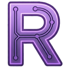

#  Renoria's Portfolio

> An interactive portfolio built as a system.

Renoria is not a traditional portfolio.

It's a structured environment designed to present projects, track progress, and simulate a living system — inspired by GDR interfaces and modular architectures.

---

# 🧩 Overview

Renoria is currently being developed as a modular web application with:

- a central dashboard
- a forum-like system 
- a logging system to track development events
- dynamic content loading
- early backend integration (PHP)

The goal is to evolve it into a fully interactive and persistent system.

---

# 🚀 Current Status — V2

Renoria V2 is now live (16/04/2026).

Key features implemented:

- Main dashboard and interface structure

---

# ⚙️ Current Features

- Dynamic interface structure
- Forum system (JSON-based)
- Log system (JSON-based)
- Modular frontend architecture

---

## 🚧 Roadmap to V3

- [ ] Board system with backend integration (PHP + MySQL)
- [ ] Bilingual support (IT / EN)
- [ ] Log system with automation capabilities
- [ ] Office module (CV, contacts, professional area)
- [ ] Admin panel
- [ ] Profile module

---

# 🛠️ Tech Stack

- HTML / CSS
- JavaScript (learning)
- PHP (learning)
- MySQL (learning)

---

# 🧠 Philosophy

This project is built to learn by doing.

Instead of isolated exercises, Renoria's portfolio is designed as a growing system:
every feature is part of a bigger structure.

Focus areas:
- system design
- modular architecture
- progressive backend integration

---

# 🌐 Live

Coming soon on: https://renoria.dev
